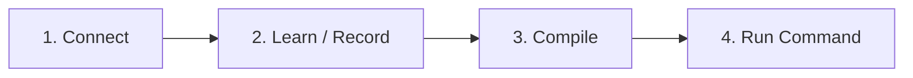

# sitecmd

> Turn any website into a programmable CLI tool.
> (dont check the website most of the things are to be built )

`sitecmd` is a CLI tool that lets you record user interactions on any website and compile them into reusable, parameterized CLI commands. Perform a task once in your browser—like searching products, filling forms, or navigating dashboards—and run it whenever you want directly from your terminal.

---

## Why sitecmd? (Key Advantages)

- **Zero-Code Automation**: Record workflows visually in your Chrome browser. No need to write Playwright/Puppeteer scripts or inspect DOM selectors manually.
- **Persistent Auth & Sessions**: Log in manually once (handling MFA, OTP, CAPTCHA, or OAuth). `sitecmd` safely persists session state in isolated local browser profiles so your commands run authenticated out-of-the-box.
- **Smart Deterministic Parameterization**: Automatically detects input fields and assigns clean, human-readable parameter names (e.g. `query`, `address`, `quantity`, `min_rating`) using smart heuristics—**100% locally with zero external LLM calls or cloud API dependencies**.
- **Smart Wait Engine**: Replaces fragile sleep timers with Playwright-backed visibility checks (`waitFor({ state: "visible" })`) to make execution fast and resilient against dynamic web pages.
- **Cross-Page Navigation Recording**: Seamlessly captures page navigations, link clicks, form submissions, and multi-page flows.
- **CLI & Pipeline Ready**: Easily chain commands into shell scripts, cron jobs, or automated workflows.

---

## Installation

Install globally via `npm`:

```bash
npm install -g sitecmd
```

Or run directly using `npx`:

```bash
npx sitecmd --help
```

> **Prerequisite**: Node.js v18+ and Chrome browser installed.

---

## How It Works (4-Step Workflow)



1. **Connect**: Authenticate with a website and save your session.
2. **Learn**: Record your clicks, typing, and page navigations interactively.
3. **Compile**: Convert the raw recording into a reusable, named command with inferred parameters.
4. **Run**: Replay the workflow anytime with custom arguments from your terminal!

---

## Step-by-Step Usage Guide

### Step 1: Connect to a Website (`sitecmd connect`)

Connect to the target website to log in and save your session state locally.

```bash
sitecmd connect https://github.com
```

- A browser window opens.
- Complete any login, 2FA/MFA, or CAPTCHA manually.
- Press **ENTER** in your terminal when logged in. The session is saved securely in a local browser profile.

---

### Step 2: Record a Workflow (`sitecmd learn`)

Start recording your actions on the connected website.

```bash
sitecmd learn https://github.com
```

- The browser opens with your saved session active.
- Perform the task you want `sitecmd` to learn (e.g., click search, type search query, navigate pages).
- When done, return to the terminal and press **ENTER**.
- `sitecmd` saves the recorded action trace into a JSON file in `./data/recordings/`.

---

### Step 3: Compile the Recording (`sitecmd compile`)

Compile the JSON recording into a named, reusable command.

```bash
sitecmd compile data/recordings/github.com-2026-08-24T12-10-58-721Z.json --name github_search
```

**Output:**
```text
Command compiled.
Name: github_search
Site: https://github.com

Parameters:
  query (string) [default: "sitecmd"]

Saved to:
data/commands/github_search.json
```

> **Tip**: If you omit `--name`, `sitecmd` will prompt you interactively for a command name.

---

### Step 4: Inspect Learned Commands (`sitecmd inspect`)

View details of any compiled command, including its site, parameters, default values, and recorded steps.

```bash
sitecmd inspect github_search
```

**Output:**
```text
Command: github_search
Site:    https://github.com

Parameters:
  - query (string) [default: "sitecmd"]

Steps (3):
   1. navigate: https://github.com
   2. click: button[aria-label="Search"]
   3. change: input[name="q"] = {{query}}
```

---

### Step 5: List Saved Commands (`sitecmd commands`)

Display all compiled commands saved on your machine.

```bash
sitecmd commands
```

**Output:**
```text
Learned commands
------------------------------------

github_search
  site: https://github.com
  parameters:
    - query (string) [default: "sitecmd"]

blinkit_order
  site: https://blinkit.com
  parameters:
    - query (string) [default: "atta dal"]
    - address (string) [default: "Home"]
```

---

### Step 6: Run a Command (`sitecmd run`)

Execute your learned command directly from your terminal! Pass custom parameters as CLI flags:

```bash
# Run with custom parameter
sitecmd run github_search --query "playwright"

# Run with default parameter values
sitecmd run github_search
```

`sitecmd` opens the browser, restores your session, applies your inputs, and executes the recorded steps automatically.

---

### Step 7: Disconnect a Session (`sitecmd disconnect`)

When you want to remove saved login sessions and clear the local profile for a website:

```bash
sitecmd disconnect https://github.com
```

---

## Smart Parameter Extraction

`sitecmd` automatically extracts parameters from input fields and normalizes them into domain-meaningful names using deterministic heuristics:

| Input Field Label / Placeholder | Inferred Parameter Name |
| :--- | :--- |
| `"Search for atta dal and more"` | `query` |
| `"Enter delivery address"` | `address` |
| `"Enter quantity"` | `quantity` |
| `"Minimum rating"` | `min_rating` |
| `"Filter by price (max)"` | `max_price` |
| `"Enter your pincode"` | `pincode` |

---

## CLI Reference Summary

| Command | Usage | Description |
| :--- | :--- | :--- |
| **`connect`** | `sitecmd connect <url>` | Connect and authenticate with a website (saves profile session). |
| **`open`** | `sitecmd open <url>` | Open a saved session browser window manually. |
| **`disconnect`**| `sitecmd disconnect <url>` | Delete local authentication session and profile data. |
| **`learn`** | `sitecmd learn <url>` | Record interactive actions (clicks, inputs, navigations). |
| **`compile`** | `sitecmd compile <recording> [--name <name>]` | Compile a raw recording trace into a reusable command. |
| **`commands`**| `sitecmd commands` | List all compiled, learned commands. |
| **`inspect`** | `sitecmd inspect <command>` | Inspect command parameters, defaults, and step flow. |
| **`run`** | `sitecmd run <command> [--param value]` | Execute a learned command with parameter overrides. |

---

## License

[ISC](LICENSE) © sitecmd Authors
